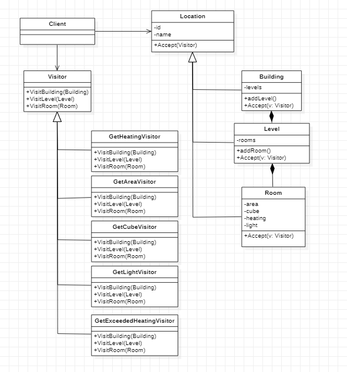

# IO-I72-Gamma
---

---
# Building Info

Dla administratorów budynków, którzy pragną optymalizować koszty zarządzania budynkami  nasza aplikacja Building Info umożliwi pozyskanie informacji o parametrach budynku na poziomie pomieszczeń, kondygnacji oraz całych budynków. Aplikacja będzie dostępna poprzez GUI a także jako zdalne API dzięki czemu można ją zintegrować z istniejącymi narzędziami.

Struktura danych
* Lokacja to budynek, poziom, lub pomieszczenie
* Budynek może składać się z poziomów a te z pomieszczeń
* Każda lokalizacja jest charakteryzowana przez:
    * id – unikalny identyfikator
    * name – opcjonalna nazwa lokalizacji
* Pomieszczenie dodatkowo jest charakteryzowane przez:
   * area = powierzchnia w m^2
   * cube = kubatura pomieszczenia w m^3
   * heating = poziom zużycia energii ogrzewania (float)
   * light – łączna moc oświetlenia

Product Backlog oraz Sprint Backlog:
<a href="https://docs.google.com/spreadsheets/d/1ySsXC-K4nm57-Rw9HnSQgmPofAk3d2ofKPhk7Z_1uO4/edit?usp=sharing" target="_blank">BuildingInfo</a>
 
Środowisko do zarządzania projektem:
<a href="https://trello.com/b/WKJo2ypG/building-info" target="_blank">Trello</a>

---
# Diagram UML

---
# Dokumentacja

https://marcinkorcz101.github.io/IO-I72-Gamma/index.html
